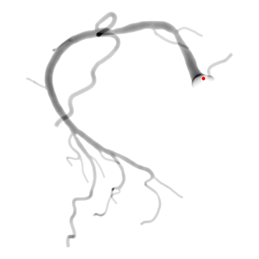

# Image‑To‑Tree with Recursive Prompting (I2TRP)

This repository contains the **official PyTorch implementation** for the paper:

> **Image‑To‑Tree with Recursive Prompting**
> *James Batten, Matthew Sinclair, Ying Bai, Ben Glocker, and Michiel Schaap*
> \[[arXiv:2301.00447](https://arxiv.org/abs/2301.00447)]

Project page: https://jamesbatten.xyz/#project-image-to-tree-with-recursive-prompting 

<p align="center">
  
  <br />
  <em>I2TRP expanding the tree one query node at a time until the full connectivity structure is recovered.</em>
</p>

## Citation

If you find this work useful in your research, please consider citing our paper:

```bibtex
@inproceedings{batten2024_image,
  author    = {James Batten and Matthew Sinclair and Ying Bai, Ben Glocker
               and Michiel Schaap},
  title     = {{Image{-}To{-}Tree with Recursive Prompting}},
  booktitle = {Proceedings of the 2024 IEEE International Symposium on
               Biomedical Imaging (ISBI)},
  pages     = {1--5},
  year      = {2024},
  doi       = {10.1109/ISBI56191.2024.10635549},
  publisher = {IEEE}
}
```

## Codebase Overview

`i2trp/` implements a **two‑stage architecture** that extracts complex tree‑structured geometries from 2‑D images:

1. **Keypoint detection** – a configurable UNet predicts candidate keypoints (roots, bifurcations, leaves).
2. **Recursive connectivity decoding** – an image‑based prompting scheme recursively predicts the edges that connect those keypoints into a tree.


---

*Licensed under the [Apache License 2.0](LICENSE) unless stated otherwise.*
